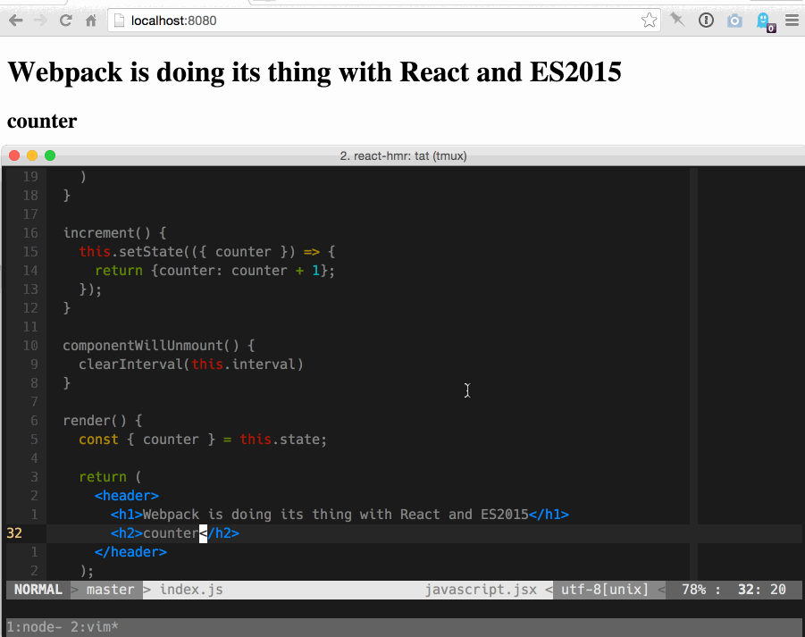
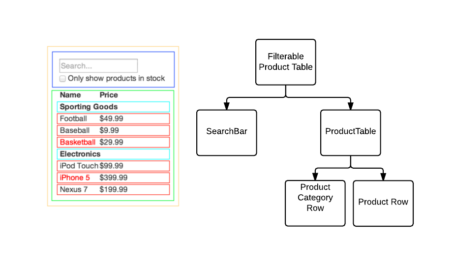

# TechNight


Excilys - Zacaria Chtatar - Mars 2017

---

## Avant propos

* J'ai 4 mois de React
* Et 3 ans de JS
* Intervenez !

---

## Sommaire

* Contexte <!-- .element: class="fragment" data-fragment-index="1" -->
* JavaScript <!-- .element: class="fragment" data-fragment-index="2" -->
* React pains <!-- .element: class="fragment" data-fragment-index="3" -->
* Du code <!-- .element: class="fragment" data-fragment-index="4" -->
* Dans la vraie vie <!-- .element: class="fragment" data-fragment-index="5" -->

---

## Introduction

1ère release : March 2013

> React is a library for providing a view for data rendered as HTML.

[](https://www.npmjs.org/package/react)
[](https://github.com/facebook/react/pulls)
[](https://github.com/facebook/react)
[](https://github.com/facebook/react)

Poussé par Facebook et l'annonce d'Angular2 <!-- .element: class="fragment" data-fragment-index="1" -->

----

## Comparaison

 | jQuery | AngularJs | Angular2 | React |
 ---|---|---|---|---|

----

## Comparaison

 | jQuery | AngularJs | Angular2 | React |
 ---|---|---|---|---|
1ère version | 2006 | 2009 | 2016 | 2013 |

----

## Comparaison

 | jQuery | AngularJs | Angular2 | React |
 ---|---|---|---|---|
1ère version | 2006 | 2009 | 2016 | 2013 |
Github stars |  |  |  |  |

----

## Comparaison

 | jQuery | AngularJs | Angular2 | React |
 ---|---|---|---|---|
1ère version | 2006 | 2009 | 2016 | 2013 |
Github stars |  |  |  |  |
Architecture | YOLO | MV* | Any | Redux |

----

## Comparaison

 | jQuery | AngularJs | Angular2 | React |
 ---|---|---|---|---|
1ère version | 2006 | 2009 | 2016 | 2013 |
Github stars |  |  |  |  |
Architecture | YOLO | MV* | Any | Redux |
Démarrage | Rapide | Rapide | Rapide | Lent |


----

## Comparaison

 | jQuery | AngularJs | Angular2 | React |
 ---|---|---|---|---|
1ère version | 2006 | 2009 | 2016 | 2013 |
Github stars |  |  |  |  |
Architecture | YOLO | MV* | Any | Redux |
Démarrage | Rapide | Rapide | Rapide | Lent | 
Courbe d'apprentissage | Faible | Important | ? | Faible |

----

## Comparaison

 | jQuery | AngularJs | Angular2 | React |
 ---|---|---|---|---|
1ère version | 2006 | 2009 | 2016 | 2013 |
Github stars |  |  |  |  |
Architecture | YOLO | MV* | Any | Redux |
Démarrage | Rapide | Rapide | Rapide | Lent | 
Courbe d'apprentissage | Faible | Important | ? | Faible |
Language | JS | JS | TypeScript | JSX |

----

## Comparaison

 | jQuery | AngularJs | Angular2 | React |
 ---|---|---|---|---|
1ère version | 2006 | 2009 | 2016 | 2013 |
Github stars |  |  |  |  |
Architecture | YOLO | MV* | Any | Redux |
Démarrage | Rapide | Rapide | Rapide | Lent | 
Courbe d'apprentissage | Faible | Important | ? | Faible |
Language | JS | JS | TypeScript | JSX |
Debug | + | - | ? | ++ |

----

## Au final

* jQuery n'est plus assez structuré pour un application scalable. <!-- .element: class="fragment" data-fragment-index="1" -->
* AngularJs n'est plus d'actualité en raison de ses perfs et son architecture. <!-- .element: class="fragment" data-fragment-index="2" -->
* Angular2 semble bon, mais ne m'inspire pas confiance. <!-- .element: class="fragment" data-fragment-index="3" -->
* React est pour moi un bon pari sur l'avenir. <!-- .element: class="fragment" data-fragment-index="4" -->

---

## Qui a choisi React ?

<div class="space-around">
  
  
  
</div>
<div class="space-around">
  
  
</div>

---

## Pourquoi ?

* Simplicité
* Predictabilité
* Composants
* Testabilité
* Nouveautés

---

## Nouveautés

React a amené de grandes innovations

----

## Hot Module Reload



----

## DOM virtuel

Le rendu est pour le navigateur l'opération la plus couteuse


----

## Isomorphisme

Grace au DOM virtuel
* Premier rendu côté serveur
* Très rapide
* Meilleur SEO


----

## React-native

Du vrai natif multi-platforme.

[](https://www.npmjs.org/package/react-native)
[](https://github.com/facebook/react-native/pulls)
[](https://github.com/facebook/react-native)
[](https://github.com/facebook/react-native)

Remplace les balises html par des composants natifs.

---

## Pause 


----

## Quiz es6

Comment ça s'est passé ?

----

## Destructuring

Déstructurer permet de créer des variables en utilisant la structure de tableaux ou d'objets.

```JavaScript
// list matching
var [a, , b] = [1,2,3];

// object matching
var { op: a, lhs: { op: b }, rhs: c }
       = getASTNode()

// object matching shorthand
// binds `op`, `lhs` and `rhs` in scope
var {op, lhs, rhs} = getASTNode()

// Can be used in parameter position
function g({name: x}) {
  console.log(x);
}
g({name: 5})

// Fail-soft destructuring
var [a] = [];
a === undefined;

// Fail-soft destructuring with defaults
var [a = 1] = [];
a === 1;
```

----

## Modules

Support des modules au niveau du langage.

⚠️️ Non supporté par Node 7

```JavaScript
// lib/math.js
export function sum(x, y) {
  return x + y;
}
export var pi = 3.141593;
```
```JavaScript
// app.js
import * as math from "lib/math";
alert("2π = " + math.sum(math.pi, math.pi));
```
```JavaScript
// otherApp.js
import {sum, pi} from "lib/math";
alert("2π = " + sum(pi, pi));
```

----

## Rest - Spread - Default Operator

```JavaScript
function f(x, ...y) { // Rest to gather
  // y is an Array
  return x * y.length;
}
f(3, "hello", true) == 6
```
```JavaScript
function f(x, y, z) {
  return x + y + z;
}
// Pass each elem of array as argument
f(...[1,2,3]) == 6 // Spread to iterate
```
```JavaScript
function f(x, y=12) { // Default to ... default
  // y is 12 if not passed (or passed as undefined)
  return x + y;
}
f(3) == 15
```

---

## JavaScript


Plus pour longtemps... <!-- .element: class="fragment" data-fragment-index="1" -->

----

## Bonnes pratiques

* Automatisation
* Linters
* Tests
* Conventions

----

## Conventions


<span class="fragment" data-fragment-index="1">
[airbnb](https://github.com/airbnb/javascript)
</span>

----

## Outils

<div class="space-around">
  [](https://www.npmjs.com) <!-- .element: class="fragment" data-fragment-index="1" -->
  [](https://babeljs.io) <!-- .element: class="fragment" data-fragment-index="2" -->
  [](https://webpack.js.org) <!-- .element: class="fragment" data-fragment-index="3" -->
  [](http://eslint.org) <!-- .element: class="fragment" data-fragment-index="4" -->
  [](https://mochajs.org) <!-- .element: class="fragment" data-fragment-index="5" -->
  [](https://karma-runner.github.io/1.0/index.html) <!-- .element: class="fragment" data-fragment-index="6" -->
  [](http://airbnb.io/enzyme) <!-- .element: class="fragment" data-fragment-index="7" -->
</div>

<span class="fragment" data-fragment-index="7">
[create-react-app](https://github.com/facebookincubator/create-react-app)
</span>

Désolé, mais le temps nous est compté 😅 <!-- .element: class="fragment" data-fragment-index="8" -->

---

## Pain points


----

## Pain points #1 : Le système de build


<span class="fragment" data-fragment-index="1">
    Babel
</span>
<span class="fragment" data-fragment-index="2">
    \+ Webpack
</span>
<span class="fragment" data-fragment-index="3">
    \+ Eslint
</span>
<span class="fragment" data-fragment-index="4">
    \+ Mocha
</span>
<span class="fragment" data-fragment-index="5">
    \+ Karma
</span>
<span class="fragment" data-fragment-index="6">
    \+ Enzyme
</span>

 <!-- .element: class="fragment" data-fragment-index="7" -->

Mais une fois en place c'est 😍 <!-- .element: class="fragment" data-fragment-index="8" -->

----

## Pain points #2 : Penser en composants



Une couleur est un même composant.

----

## Pain points #3 : Modules

* Npm donne l'accès à tout type de ressources.
* React est très dynamique <!-- .element: class="fragment" data-fragment-index="1" -->
* ⚠️️  Versions supportées <!-- .element: class="fragment" data-fragment-index="2" -->
* ⚠️️  Qualité du code <!-- .element: class="fragment" data-fragment-index="3" -->

---

## Voyons la bête


* JSX <!-- .element: class="fragment" data-fragment-index="1" -->
* Composants <!-- .element: class="fragment" data-fragment-index="2" -->
* Cycle de vie <!-- .element: class="fragment" data-fragment-index="3" -->

---

## JSX

Language alliant JS et XML !

```
// Duh 😕
React.createElement('div', { className: 'red' }, 'Hello');

// Clean 😊
<div className="red">
    Hello
</div>;
```

Les attributs sont appelés "propriétés".

Pourquoi ? <!-- .element: class="fragment" data-fragment-index="1" -->

----

```
// Duh Duh 🤢
React.createElement(
  DashboardUnit,
  { 'data-index': '2' },
  React.createElement('h1', null, 'Scores'),
  React.createElement(Scoreboard, {
    className: 'results', scores: gameScores
  })
);
```
<code class="fragment" data-fragment-index="1">
```
// Clean 😁
<DashboardUnit data-index="2">
  <h1>Scores</h1>
  <Scoreboard className="results" scores={gameScores} />
</DashboardUnit>;
```
</code>

<span class="fragment" data-fragment-index="2">
NB : Le JSX doit toujours avoir un noeud racine.
</span>

<span class="fragment" data-fragment-index="3">
NB2 : certains attributs tels que `class` sont changés en `className`.
</span>

---

## Composants

Brique UI dont la structure est définie par le JSX : déclaratif. <!-- .element: class="fragment" data-fragment-index="1" -->

<span class="fragment" data-fragment-index="2">
    Les données du composant sont paramétrées par son **état** et ses **propriétés**.
</span>

----

Avec des classes es6

```
class MyComponent extends React.Component {
    // Minimum mandatory function
    render() {
        return <div>Hello World</div>
    }
}
```

⚠️️  Les noms de composants doivent commencer par une majuscule !

----

Avec un état initial

```
class MyComponent extends React.Component {
    constructor(props) {
        // You must call super first
        super(props);
        this.state = {value: 0};
    }

    render() {
        const {value} = this.state;
        // Template interpreted with curly braces
        return <div>Is value zero ? {value === 0 ? 'yes' : 'no'}</div>
    }
}
```

A votre avis qu'affiche le composant ? <!-- .element: class="fragment" data-fragment-index="1" -->

----

Utilisation d'événements

```
class MyComponent extends React.Component {
    constructor(props) {
        super(props);
        // Manual binding, better perfs
        this.handleClick = this.handleClick.bind(this);
    }
    handleClick(e) {
      console.log(e.target.dataset.custom);
    }
    render() {
        return (<div>
            <button data-custom="manual"
                onClick={this.handleClick}>Manual bind</button>
            <button data-custom="auto"
                onClick={(e) => this.handleClick(e)}>Auto bind</button>
        </div>)
    }
}
```

----

Composition via les props et non héritage

```
// Stateless
const Presentational = (props) => {
    const {value} = props;
    return <div className="title">My value is {value}</div>
}

// Statefull
class Container extends React.Component {
    constructor(props) {
        super(props);
        this.state = {value: 0};
    }
    render() {
        // Container's state is passed to Presentationnal via props
        return <Presentational value={this.state.value}/>
    }
}
```

----

State vs Props ?

> Les propriétés sont aux composants ce que les arguments sont aux fonctions. <!-- .element: class="fragment" data-fragment-index="1" -->

> Tout comme les propriétés, l'état altère le rendu du composant. <!-- .element: class="fragment" data-fragment-index="2" -->

> Mais l'état est privé et entièrement controlé par le composant 🤢. <!-- .element: class="fragment" data-fragment-index="3" -->


----

State et props immutable

```
// GET STATE
const foo = this.state.foo;

// SET STATE

// Impossibru !
this.state = {foo:'bar'};

// Ok
this.setState({foo:'bar'});
```

Maitrise des données. <!-- .element: class="fragment" data-fragment-index="1" -->

Maitrise de l'UI. <!-- .element: class="fragment" data-fragment-index="2" -->

---

## Cycle de vie

Les composants utilisent les hooks de l'API :

* render : obligatoire <!-- .element: class="fragment" data-fragment-index="1" -->
* setState : déclenche le cycle de vie du composant <!-- .element: class="fragment" data-fragment-index="2" -->
* componentDidMount : idéal pour les appels async <!-- .element: class="fragment" data-fragment-index="3" -->
* shouldComponentUpdate : performance <!-- .element: class="fragment" data-fragment-index="4" -->
* ... <!-- .element: class="fragment" data-fragment-index="5" -->

----

En détails


---

## Les mains dans le cambouis

<a href="http://codepen.io/Muvaiah/pens/public/?grid_type=list#">
    
</a>

[Code sandbox](https://codesandbox.io/s/2vZWmQAnP)

[Zacaria/learn-react](https://www.github.com/Zacaria/learn-react)

<span class="fragment" data-fragment-index="1">[Créer le premier composant](http://codepen.io/Muvaiah/pen/GWKrPZ?editors=0010#0) -> </span>
<span class="fragment" data-fragment-index="2">[Définir l'état](http://codepen.io/Muvaiah/pen/mWbWJO?editors=0010#0) -> </span>
<span class="fragment" data-fragment-index="3">[Ajouter les contrôles](http://codepen.io/Muvaiah/pen/yMBMaR?editors=0010#0) -> </span>
<span class="fragment" data-fragment-index="4">[Découpler](http://codepen.io/Muvaiah/pen/wJwJqy?editors=0010#0) -> </span>
<span class="fragment" data-fragment-index="5">[Wrapper](https://codepen.io/Muvaiah/pen/dvMpQq?editors=0010#0) -> </span>
<span class="fragment" data-fragment-index="6">[Bouton Supprimer](https://codepen.io/Muvaiah/pen/oZxYWV?editors=0010#0) -> </span>
<span class="fragment" data-fragment-index="7">[Découpler 2](https://codepen.io/Muvaiah/pen/NpNbvd?editors=0010#0)</span>

---

## Dans la vraie vie

React n'est pas viable tout seul. 😅 <!-- .element: class="fragment" data-fragment-index="1" -->

Il faut un gestionnaire d'état. <!-- .element: class="fragment" data-fragment-index="2" -->

Redux est le consensus en place. <!-- .element: class="fragment" data-fragment-index="3" -->

 <!-- .element: class="fragment" data-fragment-index="3" -->

----

## Redux

<iframe width="560" height="315" src="https://www.youtube.com/embed/QEjf1W-rRIo" frameborder="0" allowfullscreen></iframe>

[cartoon](redux.md)

---

## Merci

Des questions ?
