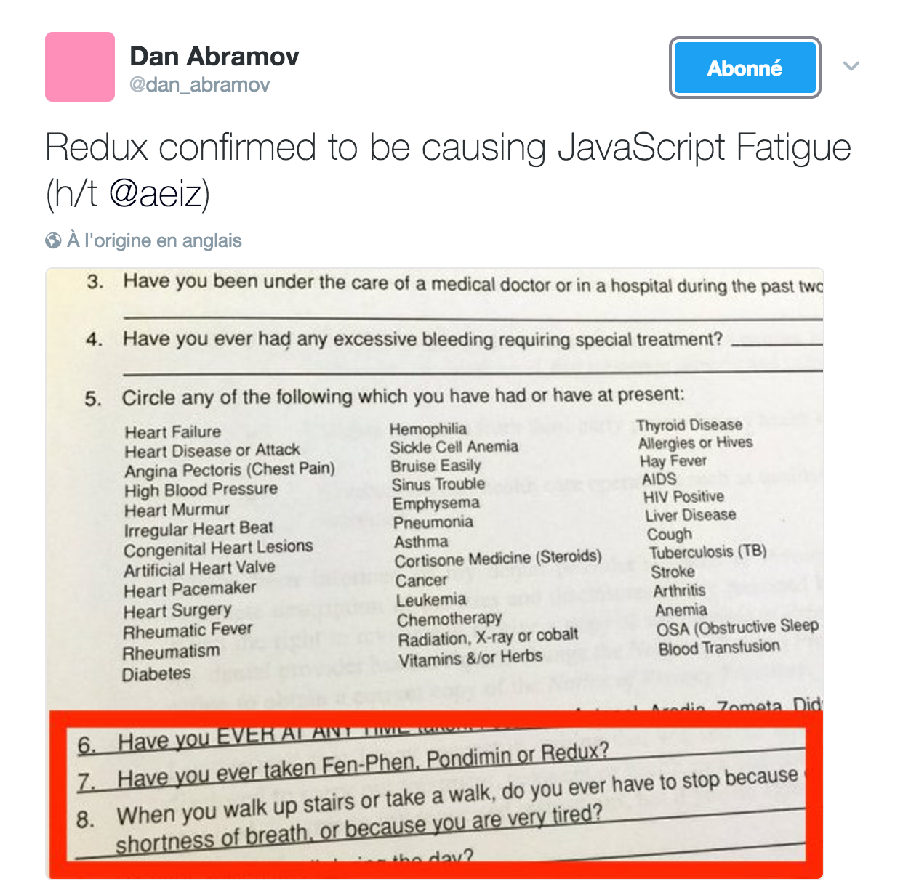

# TechNight


---

## Avant propos

* J'ai 4 mois de React
* Intervenez !

---

## Sommaire

* Introduction
* Test es6 JS
* jQuery / Angular / React
* A quoi ça sert ?
* Outils pour devenir pro-actif
* Comment apprendre

---

## Introduction

1ère release : March 2013

> React is a library for providing a view for data rendered as HTML.

[](https://www.npmjs.org/package/react)
[](https://github.com/facebook/react/pulls)
[](https://github.com/facebook/react)
[](https://github.com/facebook/react)

---

## Comparaison

 | jQuery | AngularJs | Angular2 | React |
 ---|---|---|---|---|
1ère version | 2006 | 2009 | 2016 | 2013 |
Github stars |  |  |  |  |
Architecture | YOLO | MV* | Any | Redux |
Get started | Rapide | Rapide | Rapide | Lent | 
Courbe d'apprentissage | Faible | Important | ? | Faible |
Language | JS | JS | TypeScript | JSX |
Debug | + | - | ? | ++ |

---

## Qui a choisi React ?

<div class="space-around">
  
  
  
  
</div>

---

## Pourquoi ?

* Simplicité
* Predictabilité
* Composants
* Testabilité
* Experience développeur

---

## Nouveautés

React a amené de grandes innovations

----

## Hot Module Reload


----

## Time travel debugging


----

## React-native

Du vrai natif multi-platforme

[](https://www.npmjs.org/package/react-native)
[](https://github.com/facebook/react-native/pulls)
[](https://github.com/facebook/react-native)
[](https://github.com/facebook/react-native)

----

## DOM virtuel

Le rendu est pour le navigateur l'opération la plus couteuse


---

## Pause 


----

## Quiz es6

Comment ça s'est passé ?

----

## Destructuring

Déstructurer permet de créer des variables en utilisant la structure de tableaux ou d'objets.

```JavaScript
// list matching
var [a, , b] = [1,2,3];

// object matching
var { op: a, lhs: { op: b }, rhs: c }
       = getASTNode()

// object matching shorthand
// binds `op`, `lhs` and `rhs` in scope
var {op, lhs, rhs} = getASTNode()

// Can be used in parameter position
function g({name: x}) {
  console.log(x);
}
g({name: 5})

// Fail-soft destructuring
var [a] = [];
a === undefined;

// Fail-soft destructuring with defaults
var [a = 1] = [];
a === 1;
```

----

## Modules

Support des modules au niveau du langage.

⚠️️ Non supporté par Node 7

```JavaScript
// lib/math.js
export function sum(x, y) {
  return x + y;
}
export var pi = 3.141593;
```
```JavaScript
// app.js
import * as math from "lib/math";
alert("2π = " + math.sum(math.pi, math.pi));
```
```JavaScript
// otherApp.js
import {sum, pi} from "lib/math";
alert("2π = " + sum(pi, pi));
```

----

## Default - Rest - Spread Operator

```JavaScript
function f(x, y=12) {
  // y is 12 if not passed (or passed as undefined)
  return x + y;
}
f(3) == 15
```
```JavaScript
function f(x, ...y) {
  // y is an Array
  return x * y.length;
}
f(3, "hello", true) == 6
```
```JavaScript
function f(x, y, z) {
  return x + y + z;
}
// Pass each elem of array as argument
f(...[1,2,3]) == 6
```

---

## JavaScript


Plus pour longtemps... <!-- .element: class="fragment" data-fragment-index="1" -->

----

## Outils

<div class="space-around">
  [](https://www.npmjs.com) <!-- .element: class="fragment" data-fragment-index="1" -->
  [](https://babeljs.io) <!-- .element: class="fragment" data-fragment-index="2" -->
  [](https://webpack.js.org) <!-- .element: class="fragment" data-fragment-index="3" -->
  [](http://eslint.org) <!-- .element: class="fragment" data-fragment-index="4" -->
  [](https://mochajs.org) <!-- .element: class="fragment" data-fragment-index="5" -->
  [](https://karma-runner.github.io/1.0/index.html) <!-- .element: class="fragment" data-fragment-index="6" -->
</div>

<span class="fragment" data-fragment-index="7">
[create-react-app](https://github.com/facebookincubator/create-react-app)
</span>

La JS fatigue, c'est bon pour toi 👌 <!-- .element: class="fragment" data-fragment-index="8" -->

----

## Bonnes pratiques

* Automatisation
* Linters
* Tests
* Conventions

----

## Conventions


<span class="fragment" data-fragment-index="1">
[airbnb](https://github.com/airbnb/javascript) / [standardjs](https://github.com/feross/standard)
</span>

---

## Voyons la bête


* JSX <!-- .element: class="fragment" data-fragment-index="1" -->
* Composants <!-- .element: class="fragment" data-fragment-index="2" -->
* Cycle de vie <!-- .element: class="fragment" data-fragment-index="3" -->

---

## JSX

Language alliant JS et XML !

Pourquoi ?

```
// Duh 😕
React.createElement('div', { className: 'red' }, 'Hello');

// Clean 😊
<div className="red">
    Hello
</div>;
```

NB : Le JSX doit toujours avoir un noeud racine.

----


```
// Duh Duh 🤢
React.createElement(
  DashboardUnit,
  { 'data-index': '2' },
  React.createElement('h1', null, 'Scores'),
  React.createElement(Scoreboard, {
    className: 'results', scores: gameScores
  })
);

// Clean 😁
<DashboardUnit data-index="2">
  <h1>Scores</h1>
  <Scoreboard className="results" scores={gameScores} />
</DashboardUnit>;
```

---

## Composants

Brique UI dont la structure est définie par le JSX : déclaratif. <!-- .element: class="fragment" data-fragment-index="1" -->

<span class="fragment" data-fragment-index="2">
    Les données du composant sont paramétrées par son **état** et ses **propriétés**.
</span>

----

Avec des classes es6

```
class MyComponent extends React.Component {
    // Minimum mandatory function
    render() {
        return <div>Hello World</div>
    }
}
```

----

Avec un état initial

```
class MyComponent extends React.Component {
    constructor(props) {
        // You must call super first
        super(props);
        this.state = {value: 0};
    }

    render() {
        const {value} = this.state;
        // Template interpreted with curly braces
        return <div>Is value zero ? {value === 0 ? 'yes' : 'no'}</div>
    }
}
```

----

Utilisation d'événements

```
class MyComponent extends React.Component {
    constructor(props) {
        super(props);
        // Manual binding, better perfs
        this.clickHandler = this.clickHandler.bind(this);
    }
    clickHandler(e) {
        alert('Hi ' + e.target.value);
    }
    render() {
        return (<div>
            <p onClick={this.clickHandler}>Manual bind</p>
            <p onClick={(e) => this.clickHandler(e, 'Zac')}>Auto-bind</p>
        </div>)
    }
}
```

----

Composition et non héritage

```
// Stateless
const Presentational = (props) => {
    const {value} = props;
    return <div className="title">My value is {value}</div>
}

// Statefull
class Container extends React.Component {
    constructor(props) {
        super(props);
        this.state = {value: 0};
    }
    render() {
        // Container's state is passed to Presentationnal via props
        return <Presentational value={this.state.value}/>
    }
}
```

----

State vs Props ?

> Les propriétés sont aux composants ce que les arguments sont aux fonctions.

> Tout comme les propriétés, l'état altère le rendu du composant. 
Mais l'état est privé et immutable, entièrement controlé par le composant 🤢.


----

State immutable

```
// GET STATE
const foo = this.state.foo;

// SET STATE

// Impossibru !
this.state = {foo:'bar'};

// Ok
this.setState({foo:'bar'});
```

----

Plus d'abstraction ? Voilà la factory !

```
// Configurable UI
const componentFactory = (component) => {
  return class Counter extends React.Component{
    constructor(props) {
      super(props);
      this.state = {value: 0};
    }
    render() {
      return React.createElement(
        component, {
          value: this.state.value
        });
    }
  }
}

```

---

## Cycle de vie

Les composants utilisent les hooks de l'API :

* render : obligatoire <!-- .element: class="fragment" data-fragment-index="1" -->
* setState : déclenche le cycle de rendering <!-- .element: class="fragment" data-fragment-index="2" -->
* componentDidMount : idéal pour les appels async <!-- .element: class="fragment" data-fragment-index="3" -->
* shouldComponentUpdate : performance <!-- .element: class="fragment" data-fragment-index="4" -->
* ... <!-- .element: class="fragment" data-fragment-index="5" -->


----

Au cas où


---


Live code : Bootstrap
Réutiliser de composants

[ ] Fil conducteur 

Je présente mon expérience en React
Introduction à React
Avec angular 2, les gens se posent des questions
comparaisons
Qui a choisi React : airbnb, netflix, paypal, imgur
Pourquoi ? (slide pourquoi et nouveautés)
Déjà on a parlé de React, mais pas du JS
Retour sur le test
es6 pas homogène sur les plateformes
=> babel et autres outils
Le JS dispose d'outils pour structurer
Le JS dispose de bonnes pratiques et de nombreux standards
  
!!!Montrer la mise en place d'un environnement
Maintenant je vais vous montrer la bête
Lib d'interface utilisateur
VirtualDOM
JSX
Composants
Cycle de vie
Exercice du Compteur avec tests

Comment est-ce qu'on fait quelque chose de React ?
On utilise un state manager


Pour les exercices, faire intervenir tout le monde
  ex : chacun à la suite d'un coin à l'autre de la salle
  
  
redux fatigue : 


[ ] Comparatif React vs Angular vs JSP/Jquery Tableau comparatif
[ ]     exemple : mirakl migre thymeleaf
[ ] Que puis-je faire avec React ?
[ ]     D'abord, je donne les réalisations populaires
[ ]     Ensuite, les nouvelles possiblités technique
[ ] Comment faire du JS propre et structuré ? Donner les outils et bonnes pratiques
[ ]     Airbnb
[ ]     Github
[ ] Quels sont les outils pour être pro-actif ?
[ ]     Les outils JS classiques : babel, webpack
[ ]     Les outils particuliers : Enzyme, Jest
[ ]     Les concepts/architectures : Redux, Immutable
[ ] Comment apprendre React
[ ]     Concepts clés : Redux & immutable
[ ]     Je donne des ressources
[ ]     Et un exercice : Que je n'ai pas encore !


