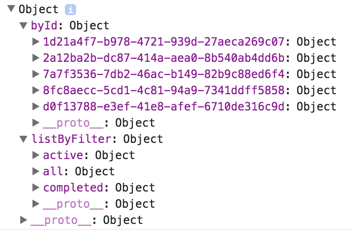

# Redux

Casting

---

## Action creator

Dev : Simple function creating action.


----

```
export const TOGGLE_SIDEBAR = 'TOGGLE_SIDEBAR'; 
export const ADD_TODO_SUCCESS = 'ADD_TODO_SUCCESS';

export const toggleSidebar = (isOpen) => ({
  type: TOGGLE_SIDEBAR,
  isOpen
});

// Asynchronous
export const addTodo = (text) => (dispatch) => api
  .addTodo(text)
  .then((response) => {
    dispatch({
      type: ADD_TODO_SUCCESS,
      response
    })
  });
```

---

## Store

Redux : Holds state of the app as the single source of truth.


----

Redux store shape



---

## Reducers


----

Creates new versions of the state using action and current state.

```
const todo = (state, action) => {
  switch (action.type) {
    case 'ADD_TODO':
      return {id: action.id, text: action.text, completed: false}
    case 'TOGGLE_TODO':
      if (state.id !== action.id) {
        return state;
      }
      return Object.assign({}, state, {
        completed: !state.completed
      });
    default:
      return state;
  }
};

export default todo;
```

----

Combine reducers

```
import { combineReducers } from 'redux';
import messages, * as fromMessages from './messages';
import messageApp, * as fromMessageApp from './messageApp';

const reducers = combineReducers({
  messages,
  messageApp
});

export default reducers;
```

---

## Views


----

* The smart passes data to the dumb via props.
* The dumb is not Redux aware.
* No one uses internal state.

---

## View layer binding


----

Map Redux state to comtainer props

```
const mapStateToProps = (state) => {
  return {
    newMessage: getNewMessage(state)
  };
};

export default connect(mapStateToProps)(AddMessage);
```

---

## Root component


----

```
import React from 'react';
import { Provider } from 'react-redux';

import ListMessage from '../../containers/listMessage/ListMessage';
import AddMessage from '../../containers/addMessage/AddMessage';

export const Root = ({ store }) => (
  <Provider store={store}>
    <div>
      <ListMessage/>
      <AddMessage/>
    </div>
  </Provider>
);

export default Root;
```

---

## Init store


----

Reducers have the same shape as the store.

```
import {createStore, applyMiddleware} from 'redux';
import todoApp from './reducers';
import thunk from 'redux-thunk';
import createLogger from 'redux-logger';

const configureStore = () => {
  //only plain object reach createLogger middleware and then reducers
  const middlewares = [thunk];
  if (process.env.NODE_ENV !== 'production') {
    middlewares.push(createLogger());
  }

  return createStore(todoApp, applyMiddleware(...middlewares));
};

export default configureStore;
```

---

## Connect store and components


----

Inject into root component

```
const store = configureStore();

ReactDOM.render(
  <Root store={store}/>, document.getElementById('mount-point'));
```

---

## Prepare action Callbacks


----

Map dispatch to props

```
const mapDispatchToProps = dispatch => {
  return bindActionCreators({
    sendMessage,
    changeNewMessage,
  }, dispatch);
};

export default connect(mapStateToProps, mapDispatchToProps)(AddMessage);`
```

---

## Workflow


---


### Credits

> Lin Clark : code-cartoons.com
