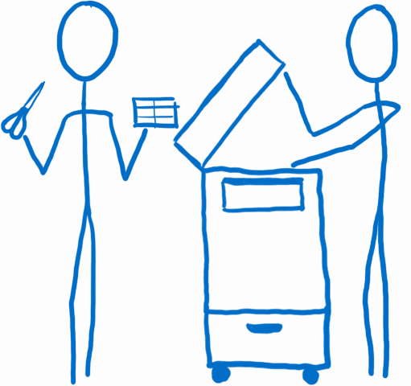
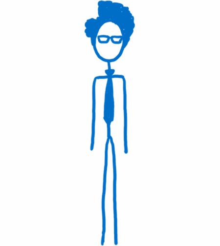
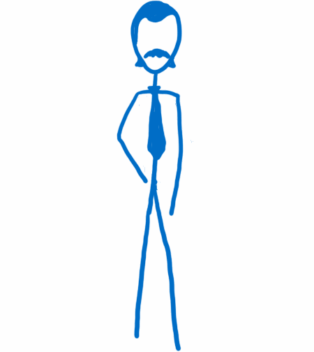
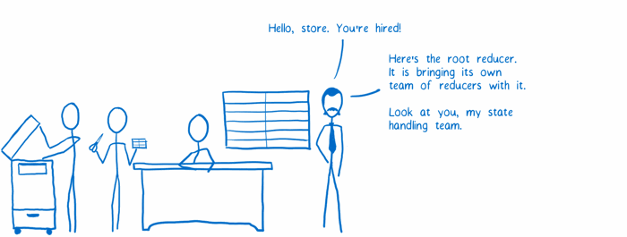
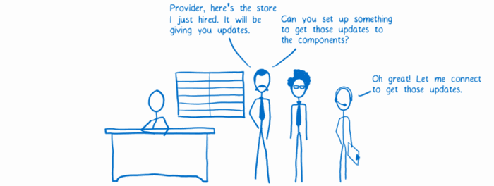
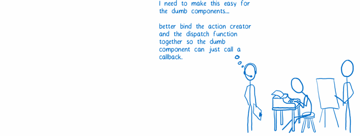
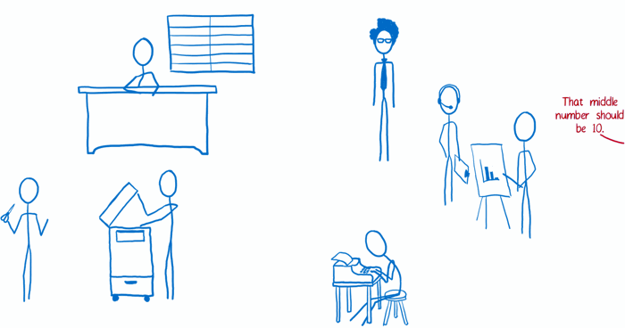

# Redux

Casting

---

## Action creator

Dev : Simple function creating action.

---

## Store

Redux : Holds state of the app as the single source of truth.

---

## Reducers

Dev : Creates new versions of the state using action and current state.

---

## Views

Dev : Smart and dumb components.

---

## View layer binding

Redux : Binds store into views using props.

---

## Root component

Dev : Gets the store as a prop.

---

## Init store

---

## Connect store and components

---

## Prepare action Callbacks

---

## Workflow

---

### Credits

> Lin Clark : code-cartoons.com
