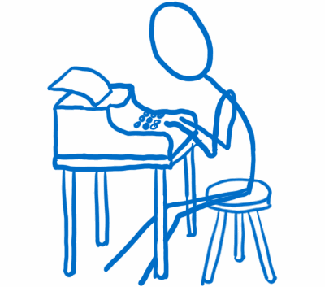
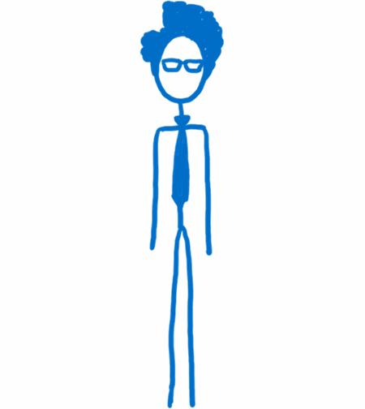
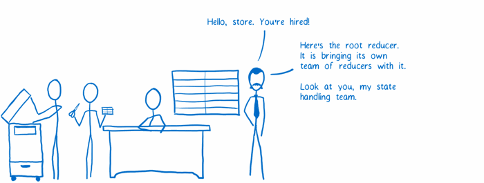
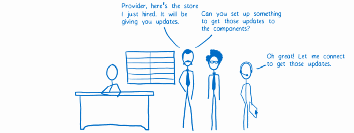
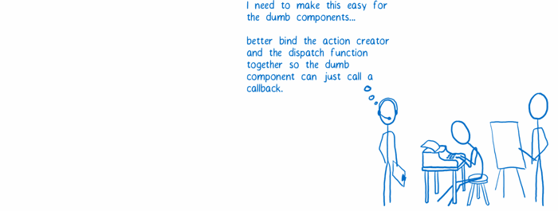
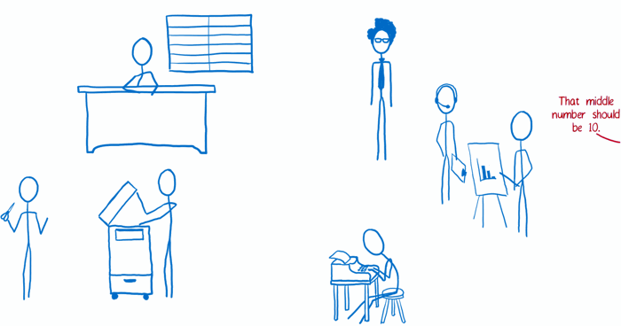

# Redux

Casting

---

## Action creator

---

## Store

---

## Reducers

---

## Views

smart and dumb components

---

## View layer binding

---

## Root component

---

## Init store

---

## Connect store and components

---

## Prepare action Callbacks

---

## Workflow

---

### Credits

> Lin Clark : code-cartoons.com